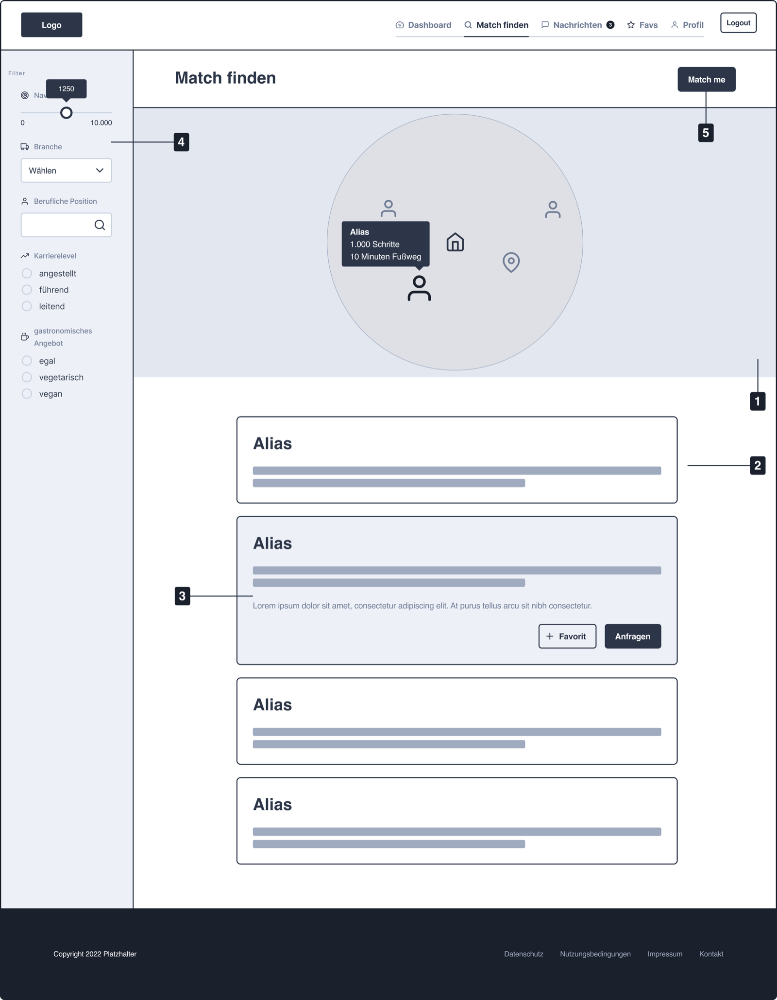
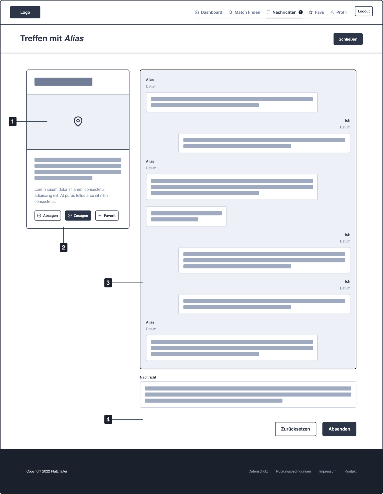
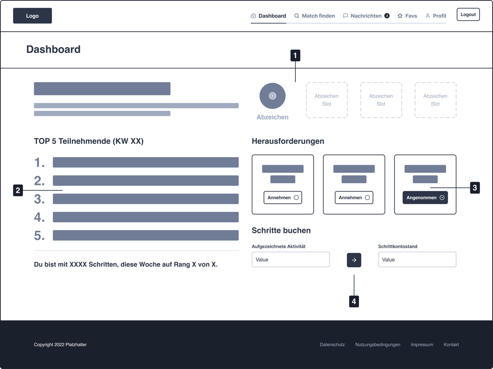

# Lunch Match

A web app that helps people working from home find someone nearby for a shared lunch break.

It is the v1 implementation of a concept developed in a Bachelor thesis
(*Wirtschaftsinformatik*, Alexander Nikolas Reuber). The thesis identified social
isolation, lack of physical activity, and technology-related stress as health
risks for remote workers, and proposed a lunch-matching application as a
countermeasure. This repository turns that concept into working software — see
[Concept and research background](#concept-and-research-background) for the
method, the stakeholder findings that shaped the product, and the original
wireframes.

## The idea

You set a step goal for your lunch break. The app converts that goal into a
search radius around your location, then shows you other participants and
possible meeting points (restaurants, cafés) within walking distance. You either
pick someone yourself, or hit **Match me** and let the app pick for you. From
there you arrange the details in a chat and confirm or decline the meeting.

Two design decisions carry most of the concept:

- **Walking distance is the unit of search.** The radius is derived from how many
  steps you want to walk, not from an arbitrary distance setting — so the app
  nudges you toward movement rather than just proximity.
- **You stay anonymous for as long as you want.** There are no email addresses
  and no passwords (see below).

## Anonymous accounts

Sign-up produces two values instead of an email/password pair:

- an **Account ID** — public, identifies you to the system
- a **Recovery Key** — secret, shown exactly once, stored only as a bcrypt hash

To sign in on another device you enter both. There is deliberately **no password
reset flow**: if you lose the Recovery Key, the account is gone. The UI states
this plainly rather than softening it. This is the same trade-off Threema makes —
no personal data is collected, and the cost is that recovery is your
responsibility.

## Tech stack

| Layer | Choice |
|---|---|
| Framework | Next.js 14 (App Router), TypeScript (strict) |
| UI | Tailwind CSS + hand-written shadcn/ui-pattern primitives (Radix) |
| Client state | TanStack Query |
| Forms | react-hook-form + zod (same schema reused server-side) |
| Database | PostgreSQL via Prisma |
| Auth | NextAuth / Auth.js v5, Credentials provider, JWT sessions |
| Maps | Leaflet + OpenStreetMap tiles |
| Geocoding | Nominatim (rate-limited to 1 req/s per OSM policy) |
| Meeting points | Overpass API |
| Tests | Vitest (pure logic only) |

No paid or API-key-gated services are used, so the project runs without any
account setup beyond a local database.

## Running it locally

Requirements: Node.js >= 20, Docker (for PostgreSQL).

```bash
npm install
cp .env.example .env                       # then set AUTH_SECRET
docker compose up -d db                    # PostgreSQL on :5432
npx prisma migrate dev                     # apply schema
npm run dev                                # http://localhost:3000
```

Generate an `AUTH_SECRET` with `openssl rand -base64 32`.

To create two demo accounts near each other in Berlin (so matching has something
to find):

```bash
npm run db:seed
```

The seed script prints each demo account's Account ID and Recovery Key. **Copy
them** — like any account, they are not retrievable afterwards.

### Scripts

| Command | Purpose |
|---|---|
| `npm run dev` | development server |
| `npm run build` | production build |
| `npm test` | run the Vitest suite |
| `npm run test:watch` | Vitest in watch mode |
| `npm run db:migrate` | apply Prisma migrations |
| `npm run db:seed` | insert demo users |

Note: running `npm run build` while `npm run dev` is running will clobber the dev
server's `.next` cache. Stop the dev server first.

## How the search radius works

Both numbers come from the thesis:

- With no step goal set, the default radius is **732 m** — the distance an average
  adult covers in a 10-minute walk at 1.22 m/s.
- With a step goal, the radius is `steps × 0.73 m`, using 0.73 m as the average
  stride length.

Changing your step goal therefore widens or narrows who and what you can find.

## Project layout

```
app/
  (auth)/page.tsx           landing page — create an anonymous account
  konto-wiederherstellen/   sign in with Account ID + Recovery Key
  profil/                   profile: alias, location, job info, step goal
  match-finden/             map + list of nearby people and meeting points
  nachrichten/              match requests and chat
  api/                      route handlers (identity, profile, match, messages)
components/
  ui/                       shadcn-pattern primitives (Button, Card, Input, …)
  Navigation.tsx            top nav, hidden when signed out
lib/
  searchRadius.ts           step goal → radius
  geo.ts                    haversine distance
  identity.ts               Account ID / Recovery Key generation + hashing
  matchFilters.ts           candidate filtering
  geocoding.ts              Nominatim client (rate-limited)
  meetingPoints.ts          Overpass client
  validation/               zod schemas shared by client and API
prisma/schema.prisma        User, MatchRequest, Message
docs/superpowers/           design spec and implementation plan
docs/wireframes/            original thesis wireframes
```

## Testing

`npm test` covers the pure logic — search radius, distance, identity hashing,
candidate filtering, and both external API clients (with `fetch` stubbed). UI
flows are verified manually in the browser; there is no automated E2E suite in
v1, which is a deliberate scope decision recorded in the spec.

## Scope

v1 covers anonymous accounts, the profile, finding a match (map, list, filters,
Match me), and the request/chat/accept-decline flow.

Gamification (leaderboard, badges, challenges, step account), the favourites
list, and real fitness-tracker sync are described in the thesis and planned for
v2 — see [TODO.md](TODO.md).

## Public demo

A live instance runs at <https://lunchmatch.nikolasreuber.de>. It is a proof of
concept, and the landing page says so: the data set may be reset without warning,
and accounts are anonymous and unrecoverable by design.

Twelve seeded demo accounts let you try it without signing up. Their credentials
live in [`lib/demoAccounts.ts`](lib/demoAccounts.ts) and are **deliberately
public** — the landing page prints them and offers one-click sign-in. Because
they are shared, their profiles and conversations drift; treat them as a
sandbox, not as a curated tour.

Anyone with an account can delete it from *Profil → Konto löschen*. Deletion
erases the profile, the user's messages and their meeting-point proposals, and
retires the credentials. The `User` row survives as an empty shell only because
`MatchRequest` holds non-nullable foreign keys to it — that is what lets the
other participant keep a readable, frozen conversation marked *Gelöschtes Konto*
instead of watching a thread disappear. See
[`lib/accountDeletion.ts`](lib/accountDeletion.ts).

`/impressum` and `/datenschutz` are public pages; the privacy policy describes
the actual processing, including that exact coordinates never leave the server
at a finer precision than the user chose.

## External services, and the limits that come with them

Three unauthenticated third-party services are used, none of which needs an API
key — a deliberate thesis constraint, so the project has no paid dependency and
nothing to rotate:

| Service | Used for | Client |
|---|---|---|
| Nominatim | turning a typed address into coordinates | [`lib/geocoding.ts`](lib/geocoding.ts) |
| Overpass API | finding candidate meeting points nearby | [`lib/meetingPoints.ts`](lib/meetingPoints.ts) |
| OpenStreetMap tile servers | the map tiles themselves | the `TileLayer` in `MapView` / `SingleMarkerMap` |

Both API clients swallow failures and return empty or `null` rather than
throwing, so an unreachable third party degrades a page instead of breaking it.
Nominatim calls are serialised through a shared promise chain to honour its
1 req/s policy; Overpass is deliberately not throttled because callers guarantee
one call per discrete user action (the invariant is stated at the top of the
file — re-check it before adding a caller).

**The limits matter if this is ever more than a demo.** All three services are
run by volunteers under usage policies that permit light, non-commercial traffic
and explicitly rule out production or commercial-scale use. Any commercial
version has to move to paid geocoding, a paid POI source, and a paid tile
provider before it takes real traffic.

That swap is contained: the two client modules above, plus the two `TileLayer`
URLs. Nothing else in the codebase talks to a third party, and neither client
leaks its shape into callers.

Map data is © OpenStreetMap contributors, attributed in both map components as
the ODbL requires.

## Deployment

Releases are cut on GitHub; the workflow builds arm64 images, pushes them to
GHCR, and triggers a Portainer webhook that redeploys the stack on a Raspberry
Pi behind SWAG. Database migrations run in the container entrypoint before the
server starts, so a failed migration keeps the old container serving rather than
bringing up a mismatched one.

Full setup, rollback and backup/restore instructions: [`deploy/README.md`](deploy/README.md).

## Concept and research background

The thesis behind this app (*Förderung sozialer Interaktion und Bewegung im
Homeoffice – Konzeption einer webbasierten Applikation*, FOM Hochschule für
Oekonomie & Management, Hamburg, January 2023) asked:

> How can an application be designed that brings people working remotely together
> for a shared lunch break in their immediate vicinity — independent of their
> employer — such that participants move regularly and reach a sufficient amount
> of daily activity?

The "independent of their employer" part is the gap. Existing lunch-matching
products are sold B2B to HR departments and optimise for *internal* networking,
which leaves out freelancers, people at small companies, and anyone whose
colleagues aren't nearby.

### How the concept was built

A three-phase deductive–inductive–constructive process:

| Phase | What happened |
|---|---|
| **Deductive** | Literature review across remote work, social isolation, physical activity, gamification and existing lunch-matching systems; first requirements derived from it |
| **Inductive** | Requirements elicitation with a stakeholder group of five — employees, managers, a self-employed developer, a physiotherapist (health domain), an IT architect (non-functional requirements) |
| **Constructive** | Application model plus a horizontal prototype of the UI as wireframes |

Instead of transcribed expert interviews, requirements were elicited with the
**"Nine Boxes"** questioning technique and translated directly into user stories,
documented as epics in the **Connextra template** with acceptance criteria as
Given/When/Then scenarios, so each is testable:

```
As a [role]
I want [function]
so that I achieve [goal].

Scenario 1: <title>
  Given   [context]
  When    [event] occurs
  Then    [outcome]
```

That produced eight epics: Core functions · Profile · Matching · Finding
participants and meeting points · Messaging · Step account · Gamification ·
Favourites. The first five are v1; the rest are in [TODO.md](TODO.md).

### What the research changed about the product

The useful part is where the stakeholder interviews *contradicted* the
literature. Three findings, the screens they produced, and where they live in
this codebase. (The wireframes are the original thesis artefacts, so they are in
German; the numbered markers are the annotations from the thesis text.)

**1. People don't want to be matched randomly — they want control.**

The literature frames lunch-matching as an algorithmic pairing problem. The
stakeholder group consistently wanted the opposite: filters on industry, role and
career level, and a map to see who is actually nearby. This independently
reproduces a finding by Karapantelakis & Gou (2014) — people don't extend enough
trust to a preference-based algorithm to let it choose for them. Random matching
survives only as an optional **Match me** button, as a game element.



> **1** Map showing participants within the search radius · **2** Result list,
> collapsed · **3** Expanded entry with request and favourite actions · **4**
> Filters: radius in steps, industry, position, career level, food preference ·
> **5** "Match me" for optional random matching

→ `app/match-finden/`, `lib/matchFilters.ts`

Note the map tooltip: not a distance in kilometres, but *"1.000 Schritte /
10 Minuten Fußweg"* — the unit the user actually plans in. See
[How the search radius works](#how-the-search-radius-works).

**2. Messaging became the centre of the app, not a side feature.**

Participants wanted a short exchange *before* committing to meet a stranger — to
gauge the other person's motivation and agree on a spot. One stakeholder compared
it to haggling on a classifieds platform: time and place matter less than how the
other person communicates. This made several literature-derived requirements
obsolete (automated meeting-point selection, search-radius negotiation) and was
the genuinely new insight of the work.



> **1** Proposed meeting point on the map · **2** Accept / decline / favourite for
> the meeting itself · **3** Message thread between the two participants · **4**
> Compose and send

→ `app/nachrichten/`, `lib/meetingPointNegotiation.ts`

The negotiable meeting points in v1 are a direct descendant of this finding: the
meeting place is settled *between* the two people rather than assigned by the
system.

**3. Movement is a secondary motive; time is the primary constraint.**

Nobody plans a break around step goals — they plan around how long the break is.
So the search radius is derived from the step goal *combined with* walking
duration rather than distance alone, and activity gets nudged indirectly, through
gamification and a fitness-tracker interface reporting step counts back into the
app.



> **1** Badge slots, earned through challenges · **2** Weekly top-5 leaderboard
> with the user's own rank · **3** Challenges to accept · **4** Step account, fed
> from recorded activity

→ `lib/searchRadius.ts` for the radius; the dashboard itself is v2.

### Open questions from the thesis

The thesis was explicit about its limits. Where v1 answers one, it is noted:

- **Privacy.** Location-based search raises obvious data-protection questions. The
  thesis proposed letting users choose their own location granularity and
  obfuscating marker positions. **v1 goes further:** anonymous accounts mean there
  is no email address or password to protect in the first place (see
  [Anonymous accounts](#anonymous-accounts)), plus `lib/locationPrivacy.ts`.
- **Chat-app drift.** A messaging-centric design risks becoming yet another chat
  client — or being read as a dating app — which would defeat the goal of getting
  people to meet in person. Discussed mitigations: capping messages per request,
  and unlocking free-text messaging only after a completed, positively rated
  meeting. **Still open.**
- **Density and viability.** The app needs enough users in an area to work at all,
  which is unresolved for rural regions, as is monetisation. **Still open.**
- **Method limits.** Five stakeholders is a small group, and a horizontal
  prototype covers breadth, not depth — validating individual components needs a
  vertical prototype. That is what this repository is.

The full thesis is not published; I am happy to share the PDF on request.

## Language

The user interface is in German, matching the thesis. Code, comments, and
documentation are in English.

## Licence

The thesis and this implementation are the sole work of the author; no company
or institute holds rights in them.

No licence has been chosen yet, which means the default applies: **all rights
reserved**. You are welcome to read the code and to fork it on GitHub, but no
right to use, modify, redistribute or run it is granted.
